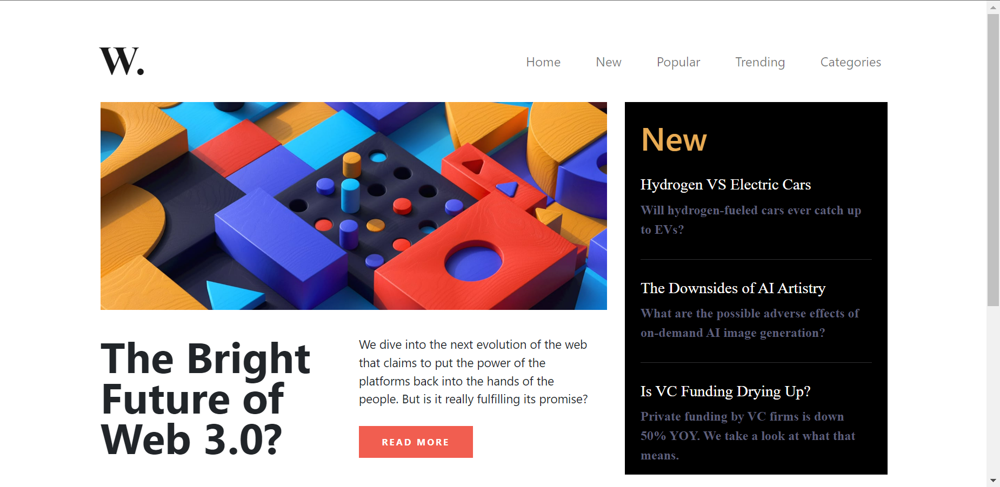

# DOM Assignment

## Assignment 1

### 1.Task 1


Solution

 ``` js
 let menu=document.createElement("li");
menu.innerText="Hire Me";
menu.style.color="rgb(75,74,74)";
menu.style.fontWeight=500;
document.getElementsByTagName("ul")[0].append(menu);
 ```

### 1.Task 2


Solution

```js
let ph=document.getElementsByTagName("input");
ph.placeholder="Search My project";

```

### 1.Task 3


Solution

```js
let demo=document.querySelector('p');
demo.innerHTML="I am an aspiring <span>Full Stack Javascript Developer</span> <br> who is currently working as</span> an Employeee</span> for <br><span> iNeuron Intelligence Pvt Ltd.</span>"
```

### 1.Task 4


Solution

```js
let image=document.querySelector('img');
image.src="./photo.jpeg";

```

### 1.Task 5


Solution

```js
let btn=document.createElement('button');
var text=document.createTextNode('Support Me');
btn.appendChild(text);

let cl=document.querySelector('.hero-right-section-btns');
cl.appendChild(btn);
```

## Assignment 2

### 2.Task 1


solution:

```js
const nodeList = document.querySelectorAll(".accordian h3");
for (let i = 0; i < nodeList.length; i++) {
  nodeList[i].style.backgroundColor = "#d8d8f4";
}
```

### 2.Task 2


solution:

```js
const nodeListp = document.querySelectorAll(".accordian p");
for (let i = 0; i < nodeList.length; i++) {
  nodeListp[i].style.backgroundColor = "#e3e3f7";
}
```

### Assignment 3


solution:

```js
const input = document.querySelector(".userName");
const log = document.querySelector(".enterName");

input.addEventListener("input", updateValue);

function updateValue(e) {
  log.value = e.target.value;
}

const useremail = document.querySelector(".userEmail");
const eneteremail = document.querySelector(".enterMail");

useremail.addEventListener("input", updateEmail);

function updateEmail(e) {
  eneteremail.value = e.target.value;
}

const usermsg = document.querySelector(".userMessage");
const entermsg = document.querySelector(".enterMessage");

usermsg.addEventListener("input", updateMessage);

function updateMessage(e) {
  entermsg.value = e.target.value;
}
```

### Assignment 4


Solution:

```js
const bar = document.querySelector('.clash-card__unit-stats--barbarian');
bar.style.backgroundColor = '#ec9b3b'; 

const ar = document.querySelector('.clash-card__unit-stats--archer');
ar.style.backgroundColor = '#ee5487';

const gi = document.querySelector('.clash-card__unit-stats--giant');
gi.style.backgroundColor = '#f6901a';

const gob = document.querySelector('.clash-card__unit-stats--goblin');
gob.style.backgroundColor = '#82bb30';

const wiz = document.querySelector('.clash-card__unit-stats--wizard');
wiz.style.backgroundColor = '#4facff';

const fc=document.querySelectorAll('.stat, .stat-value');
fc.forEach(element => {
    element.style.color = 'white';
});


```

### Assignmant 5


Solution:

```js
const tagsContainer = document.querySelector(".tags-container");
const newAnchor = document.createElement("a");
newAnchor.setAttribute("href", "#");
newAnchor.textContent = "Chinese (7)";
tagsContainer.querySelector("div").appendChild(newAnchor);

const newCard = document.createElement("div");
newCard.classList.add("card");
newCard.innerHTML = `
                <a href="#" class="recipe-text">
                    
                    <h5 class="recipe-name">Dabeli</h5>
                    <p class="recipe-disp">Prep : 30min | Cook : 7min</p>
                </a>
            `;
const recipeGallery = document.querySelector(".recipe-gallery");
recipeGallery.appendChild(newCard);
```

## Assignmant 6

### 6.Task 1


Solution:

```js
let logo=document.querySelector('.logo');
logo.src='./assets/ineuron-logo.png';
logo.width=550;
let text=document.querySelector('.hero');
text.style.fontWeight='lighter';
text.style.fontSize='15px';
let main=document.querySelector('main');
main.style.marginLeft="93px";
main.style.marginRight="93px";
```

## 6.task 2


Solution:

```js
let price=document.querySelector('.app_price');
price.innerHTML='<span>$10</span>/month';
```

## 7.Assignment 7

### 7.Task 1


Solution:

```js

let links=document.querySelectorAll('a');
for (var i = 0; i < links.length; i++) {
    var link = links[i];
    if (link.textContent.includes('2.0')) {
      link.parentNode.removeChild(link);
    }
  }
```

### 7.Task 2


Solution:

```js
var valuesWith2_0 = [];

let links=document.querySelectorAll('a');
for (var i = 0; i < links.length; i++) {
    var link = links[i];
    if (link.textContent.includes('2.0')) {
      valuesWith2_0.push(link.textContent);
      link.parentNode.removeChild(link);
    }
  }
  
window.onload = function() {
    // Your code here
    var inputElement = document.querySelector('.main__form-input');
    inputElement.value = "Value added using JavaScript";
}
  
let btn=document.querySelector('.main__form-btn');
btn.disabled=false;
btn.addEventListener("click", refresh);

function refresh(){
  link.parentNode.appendChild(valuesWith2_0);
  e.preventDefault();
}
```

## Assignmant 8

### 8.Task 1


Solution:

```js

let asideElement = document.querySelector('aside');

let hrElement2 = document.createElement('hr');
let h2Element2 = document.createElement('h2');
let pElement2 = document.createElement('p');

hrElement2.classList.add('hr-line');
h2Element2.classList.add('new-head');
pElement2.classList.add('new-p');

h2Element2.innerHTML = `<h2 class="new-head">This is custom heading</h2>`;
pElement2.innerHTML = '<p class="new-p">This is a new paragraph inside the aside tag. This is a new paragraph inside the aside tag.</p>';

asideElement.appendChild(hrElement2);
asideElement.appendChild(h2Element2);
asideElement.appendChild(pElement2);

asideElement.style.overflowY = 'scroll';

```

### 8.Task 2



Solution:

```js
let background=document.querySelector('body');
background.style.backgroundImage='none';
```

### 8.Task 3


Solution:

```js
const toggleButton=document.querySelector('button');
const navList=document.getElementById('navbarTogglerDemo01');
toggleButton.addEventListener('click', () => {
    navList.classList.toggle('show');
});
```
